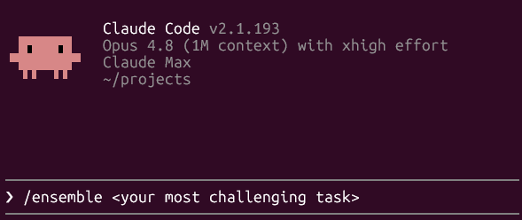
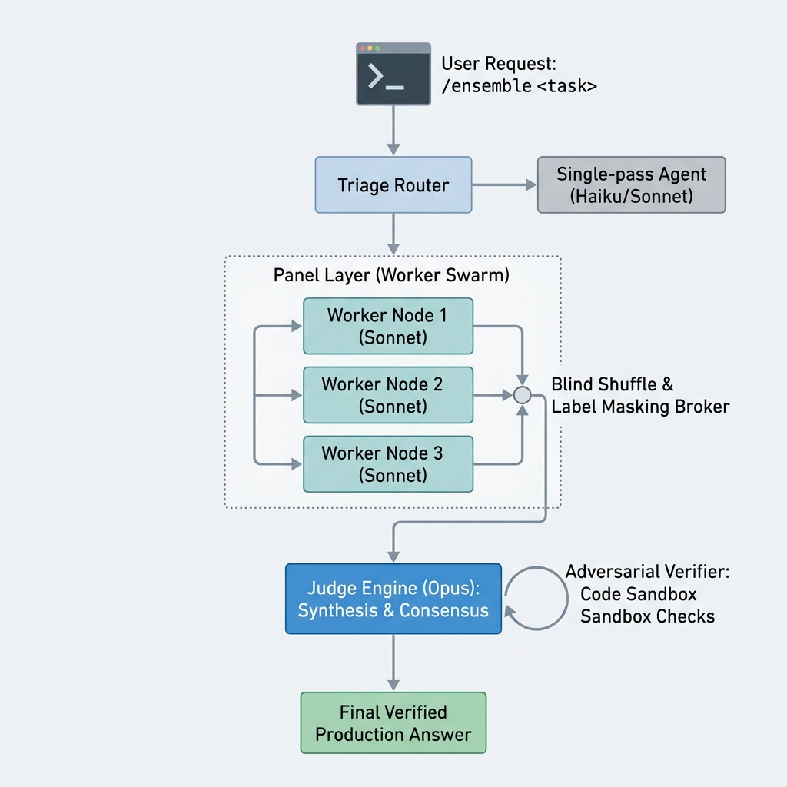

# claude-ensemble



---

Claude Ensemble is an open source agentic tool for Claude Code to push the model capability to tackle the hardest challenges.
Claude Ensemble leverages agentic orchestration and [Dynamic Workflows](https://code.claude.com/docs/en/workflows) to achieve the model's maximum intellectual capabilities, made accessible through a Claude subscription (Pro, Max) alone.
It runs entirely inside Claude Code on your Pro/Max subscription — **no API key needed.**

---

## Why this matters to you

1. It is built for **the most challenging tasks**

> Whether it is designing a software architecture or solving a business problem, the *ensemble* pattern (multi-layer orchestration of autonomous agents) can match or approach a single frontier model on the most challenging problems and ambitious tasks.

2. It is built for **Claude Code**

> With Claude Pro or Max subscription, you can capture the benefit of maximum intelligence of Claude at the expense of extra [usage](https://claude.ai/settings/usage). No need to commit an API key, so you won't be billed on token-based pricing.

3. It is built to **adapt to new model release**

> The ensemble is designed to push the newest model's capability even further. The kit follows new Claude models with no edit, so you're ensured to have the most frontier model capability at any point in time.

## What you need

- **Claude Pro or Max subscription.** Max is recommended for sufficient Opus usage.
- **Claude Code v2.1.154 or later.** The deterministic engine (`.claude/workflows/ensemble.js`) requires the Dynamic Workflows feature

> Claude Fable 5 is **not** used or required.

## To start using Claude Ensemble

```bash
git clone https://github.com/tyoon10/claude-ensemble
# into one project:
cp -r claude-ensemble/.claude/* /path/to/your/project/.claude/
# …or make it available everywhere. This writes into your global config; -n avoids
# overwriting same-named files (the kit's files are all ensemble-* namespaced, so
# collisions are unlikely):
cp -rn claude-ensemble/.claude/* ~/.claude/
```

Then, in Claude Code, ensure you have enabled dynamic workflows (one-time configuration):

```
/config workflows=true
```

Then run the ensemble:

```
/ensemble <Describe your task — add your context, goals, constraints, etc.>
```

## How it works



- **Triage** skips the panel for easy tasks, so you don't spend usage limits where a single pass already wins.
- The **panel** is **three independent best-effort drafts of the same task** (best-of-N). We tested designed "diversity" — objective roles, tier mixes — and it didn't beat this; the lift comes from the judge synthesizing several attempts, not from making them differ (see [`eval/`](eval/)).
- The **judge** sees the drafts under blind, shuffled labels (no model names) to cut judge bias, verifies rather than trusts, and synthesizes one answer better than any single draft.
- The **verify-loop** runs only on **checkable** tasks (the triage gate decides — no flag): a harsh verifier **runs code** to find confirmed defects in the judge's answer, a reviser fixes exactly those, repeating up to 3× or until clean. This is the kit's biggest measured correctness lever; on open-ended/judgment tasks it's skipped (nothing to verify against).

## Cost & performance

**Cost is structural, not a price.** On a subscription you spend usage, not dollars — and the gatekeeper keeps easy work off the panel, so you only pay the ensemble premium on genuinely hard tasks:

| Path | Model calls | Relative spend\* |
|---|---|---|
| Single model (baseline) | 1× Opus | 1× |
| Ensemble — simple (gated out) | 1× Haiku + 1× Sonnet | < 1× |
| Ensemble — complex | 1× Haiku + 3× Opus panel + 1× Opus judge (+ verify-loop on checkable) | ~5–10× |

<sub>\*Indicative, from the call structure and per-tier token rates — **not a measurement**. Actual spend depends on task and output length.</sub>


**Performance (honest).** We A/B-tested this on a subscription — blind pairwise win-rate, length-controlled, with an independent non-Claude cross-grader. Two findings shaped the design: (1) a **Sonnet panel ≈ a single pass** (no real quality gain), so the kit *skips* it — simple tasks get one cheap pass, and genuinely hard tasks go straight to an **Opus panel** (the real quality jump); (2) the **verify-loop** — on checkable tasks, where a harsh verifier runs code to fix real defects — is the **biggest lever**, and it pays off most on the strong Opus-panel answer. So the kit spends Opus where it counts and gates cheap work away. Full method, per-version results, per-task data, and caveats live in **[`eval/`](eval/)**.

**Honest limits:**
- **Claude-only panel = correlated errors.** Every panelist is a Claude model, so they share blind spots — more correlated than a true cross-vendor panel. Whether genuine cross-vendor diversity would help *more* is untested (it needs non-Claude API keys — out of scope here).
- **It spends real Opus usage.** A complex run is an Opus panel (3 Opus drafts) + an Opus judge + the verify-loop — Opus-heavy, so **Max is recommended**. The triage gate keeps easy tasks on a cheap single pass; for a lighter footprint set `PANEL_MODEL='sonnet'` (the cost-efficient panel).
- **Not a benchmarked guarantee.** A pragmatic pattern — strongest on decomposable, deep-reasoning, and checkable work; weakest where you needed truly independent opinions on one indivisible question. Directional on these task sets (n = 6–12), not a general benchmark.

## Built on Claude Code

This is pure Claude Code configuration — no server, no SDK, no external service:

- the `/ensemble` command runs a **[Dynamic Workflow](https://code.claude.com/docs/en/workflows)** — `agent()` / `parallel()` in a local JavaScript script that owns the control flow;
- the panel + judge run as **[sub-agents](https://code.claude.com/docs/en/sub-agents)** the workflow spawns programmatically — their prompts live inline in the script.

**Staying on the latest models.** The workflow selects models by **tier alias** — `opus`, `sonnet`, `haiku` — and each alias resolves to the newest release of that tier, so the kit follows new Claude models with no edit. Pin a specific version (e.g. `claude-opus-4-8`) only when you want reproducibility.

## Configure

It's all plain Markdown plus one JS file — edit to taste:

- **Models / panel size / effort:** edit the constants in `.claude/workflows/ensemble.js` — `PANEL_MODEL` (panel tier, default `opus`), `SIMPLE_MODEL` (the gated single pass, default `sonnet`), `JUDGE_MODEL`, `GATE_MODEL`, `JUDGE_EFFORT`, and `PANEL_N`. **Prompts** (panelist, judge, verifier) live inline in the same file.
- **Cheaper runs:** set `PANEL_MODEL = 'sonnet'` (the cost-efficient panel — ≈ a single pass on quality, but far lighter on Opus limits), or drop `PANEL_N` to two.
- **Deterministic engine:** `.claude/workflows/ensemble.js` runs the pipeline as a scripted Dynamic Workflow (no orchestration-token tax, reproducible). The judge runs at `max` effort — the biggest quality lever we measured (see [`eval/results-phaseA.md`](eval/results-phaseA.md)).

## Files

```
.claude/
  commands/ensemble.md            # the /ensemble slash command — thin wrapper that runs the workflow
  workflows/ensemble.js           # the self-contained engine (triage · panel · judge · verify-loop; prompts inline)
```

## License

MIT © 2026 Taewan Yoon. See [LICENSE](LICENSE).

> It's an *ensemble* (independent models combined), not a Mixture-of-Experts (sparse routing inside one model) — the name is deliberate.
