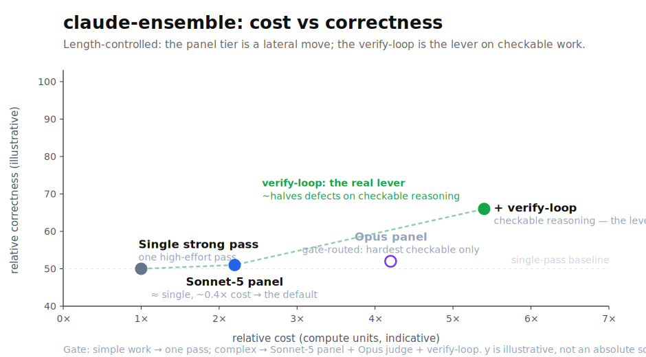

# claude-ensemble — evaluation

An honest, reproducible evaluation of the ensemble vs a single Claude model, run entirely on a subscription. This page is the **research summary**, organized by question. The chronological per-experiment logs — with every reversal kept — are in the [appendix](#appendix--experiment-log).

## Result of record

**The shipped kit.** Triage → *simple* tasks get one Sonnet pass; *hard* tasks get a best-of-N **Opus** panel → a **`max`-effort Opus judge** → a **verify→revise loop** (runs code, on checkable tasks only).

**What we found, in one line.** The panel's edge over a single *matched-effort* pass is **small and length-sensitive**; the real correctness lever is the **judge (its effort) and the verify-loop** — *not* panel diversity, breadth, or model tier. It's a real, fact-checking-driven edge on hard *checkable* work — **not** a blanket "ensembles beat single models."

| Question | Finding | Detail |
|---|---|---|
| **RQ1** — does it beat a single model? | small, real, length-sensitive (≈60% pairwise → mostly **ties** once length-controlled) | [§RQ1](#rq1--does-the-ensemble-beat-a-single-model-and-by-how-much) |
| **RQ2** — what is the lever? | **judge effort + verify-loop** — not diversity, breadth, or tier | [§RQ2](#rq2--what-is-the-lever) |
| **RQ3** — cost vs quality | ~5–10× a single call on hard tasks; easy tasks gated to one pass | [§RQ3](#rq3--cost-vs-quality) |

## RQ1 — Does the ensemble beat a single model, and by how much?

**Yes, but modestly — and the honest magnitude is far smaller than a naive rubric suggests.**

- An absolute 0–100 rubric **saturates** on strong answers (the baseline already scores ~90), over-stating the gap. The first run showed only **+4.2** ([v1](results.md)) for exactly this reason; on harder, higher-headroom tasks the same rubric widened to **+8.6 / +9.5** with single-Opus winning **0/12** ([v2](results-v2.md)) — the small v1 margin was a ceiling artifact, not a weak system.
- Switching to **blind pairwise win-rate** (graded in **both answer-orders**) plus an **independent non-Claude grader** put the Opus panel at **≈60%** over a *matched-effort* single Opus pass, cross-grader-confirmed (Gemini ≈62%) ([v3](results-v3-pairwise.md)) — about half the rubric magnitude.
- **Length-controlled**, even that ≈60% mostly collapses to **ties**: a Sonnet panel ≈ a single pass, the Opus panel only marginally ahead on correctness ([v4](results-v4-length-controlled.md)). Pairwise grading rewards longer answers, and once that's removed the panel's *own* edge is small.

**Takeaway.** The panel alone buys a small, length-sensitive edge. What makes the kit worthwhile is the lever in RQ2 — not panel breadth.

## RQ2 — What is the lever?

**The judge (its effort) and the verify-loop — not panel diversity, breadth, or tier.**

- **Diversity is not the lever.** Across arms spanning low→high draft diversity, the diversity↔lift correlation is **r = −0.11** (no relationship); the *lowest*-diversity (homogeneous) panel had the *highest* lift ([Phase B](results-phaseB.md)). Designed "objective roles" (drafter / adversary / alt-method) *underperformed* a plain homogeneous best-of-N (+3.0, 8/12) and were dropped ([panel](results-panel.md)).
- **Breadth saturates fast.** A 3-draft panel ≫ 1; 5 beats 3 only modestly; 9 ≈ 5. One draft *copied* three times gives no lift — it's **independent samples** (coverage), not more context ([Phase B](results-phaseB.md)).
- **Judge effort is the single biggest knob.** In a six-variant judge ablation, raising the judge's effort with **no prompt change** was the largest improvement (**+2.4**); *over*-instructing it (a rigid 7-step procedure) was the **worst** arm (**−4.7**) ([Phase A](results-phaseA.md)). The kit ships a `max`-effort judge with an open prompt.
- **The verify-loop is the biggest correctness lever.** On checkable tasks the kit runs a prosecutorial verify→revise loop that **runs code** to find and fix real defects, roughly **halving** them ([v5](results-v5-verify-loop.md)).

**Takeaway.** Spend on the *judge* and the *verify-loop*; designed diversity and extra breadth/tier are not where the gain is. That's why the kit uses a homogeneous best-of-N panel feeding a high-effort verifying judge.

## RQ3 — Cost vs quality

A single strong pass is the cheap baseline; the Opus panel is the quality jump; the verify-loop (checkable tasks) is the top. A complex run is ~5–10× a single call, so the triage gate keeps easy work on a single pass — you pay the premium only where it helps.

## Methodology

- **Tasks.** Deliberately hard, rubric-bearing tasks across domains (systems design, debugging, math, coding, security, analysis, data modeling, deep-research, conceptual precision). 6–12 per experiment; the sets are embedded in the harness scripts.
- **Scoring evolved — and the evolution is itself a finding.** Absolute 0–100 rubric → it *saturates* on strong answers → **blind pairwise win-rate**, graded in **both answer-orders** to cancel position bias → add an **independent non-Claude grader** (Gemini-Flash) to test same-family preference → **length-controlled** re-grading to strip the residual length bias pairwise carries. Each step was forced by a measured flaw in the previous one — a cautionary tale for evaluating near-frontier, same-family systems.
- **Blinding.** Answers shown under randomized labels with provenance stripped; two judges (Opus + Sonnet) under strict anti-saturation calibration; both answer-orders.

## Threats to validity (read these)

- **Small n.** 6–12 tasks per experiment — an *indication, not a benchmark*; results do not generalize beyond these task sets.
- **Same-family graders.** The judges are Claude models and the synthesizer is Opus; mitigated by a cross-tier Sonnet judge and a non-Claude (Gemini) cross-grader, but not eliminated. Treat deltas as directional.
- **Subscription-only / single-vendor.** No cross-vendor panel, by design; whether cross-vendor diversity would help *more* is **untested, not rejected** (see [`REFERENCES.md`](../REFERENCES.md)).
- **Cost is structural, not metered.** Per-system token usage isn't separately measured; the cost picture is the call-structure model in the [top-level README](../README.md).

## Reproduce

Each experiment is a Claude Code Dynamic Workflow plus a pure-stdlib chart script (no matplotlib). Run the workflow (the task set is embedded), save the returned JSON to the matching `raw-*.json`, then `python3 <chart>.py`. Harnesses: [`run.js`](run.js) (v1) · [`run-v2.js`](run-v2.js) · [`phaseA.js`](phaseA.js) · [`phaseB.js`](phaseB.js) · [`panel.js`](panel.js).

## Appendix — experiment log

The chronological trail, every reversal kept — this is where "we changed our mind" lives, and each step corrected a *measured* flaw in the previous one:

| # | Experiment | What it established |
|---|---|---|
| v1 | [results.md](results.md) | ensemble vs single Opus on an absolute rubric — +4.2, later shown a saturation artifact |
| v2 | [results-v2.md](results-v2.md) | harder tasks un-saturate the rubric (+8.6/+9.5); a pricier Opus panel barely helps *at an xhigh paraphrasing judge* |
| Phase A | [results-phaseA.md](results-phaseA.md) | judge **effort** is the lever (+2.4); over-instructing the judge hurts (−4.7) |
| Phase B | [results-phaseB.md](results-phaseB.md) | draft **diversity** does not predict lift (r=−0.11); breadth saturates by ~N=5 |
| panel | [results-panel.md](results-panel.md) | homogeneous best-of-N beats objective roles (+3.0) — roles dropped |
| v3 | [results-v3-pairwise.md](results-v3-pairwise.md) | blind pairwise + non-Claude cross-grader (≈60%) — supersedes the rubric magnitude |
| v4 | [results-v4-length-controlled.md](results-v4-length-controlled.md) | length-controlled — the edge mostly reduces to ties |
| v5 | [results-v5-verify-loop.md](results-v5-verify-loop.md) | the auto verify-loop — the biggest correctness lever |
| v6 | [results-v6.md](results-v6.md) | Sonnet 5 re-run — a Sonnet-5 panel *ties* the Opus panel (cheap panel now viable); length confound re-confirmed; caught a judge-format confound |
| v6b | [results-v6.md](results-v6.md) | confound re-check with a clean judge — the leak fully drove v6's "single ahead" (single wins 0/32), so single Opus ≈ both panels, a tie. Judge fix shipped to `ensemble.js` |
| v6c | [results-v6.md](results-v6.md) | residual-edge probe — Opus panel 0 confirmed defects on hard checkable tasks vs 3 for the Sonnet-5 panel; a real draft-cleanliness edge the verify-loop mitigates on checkable work |
