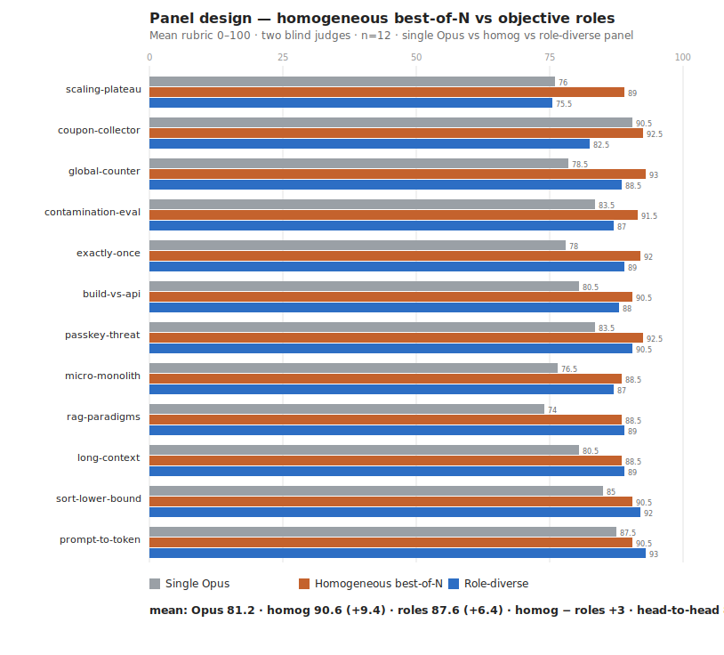

# Results — panel design: are the objective roles load-bearing?

> **Methodology trail — findings stand, but any "default/shipped" config named below is superseded.** The shipped kit now defaults to a best-of-N **Opus** panel → **max-effort Opus judge** → verify→revise loop. See the [eval index](README.md) and the [top-level README](../README.md).

The kit originally used an *objective-diverse* panel — a drafter, an adversary, and an alt-method solver — on the theory that different jobs de-correlate errors. Phase B already showed diversity doesn't predict lift; this test asks the sharper product question directly: **does the role panel beat a plain homogeneous best-of-N panel** (3× the same Sonnet, identical "give your best answer" prompt)?

**Design.** single Opus baseline vs **homog** (3× Sonnet, identical prompt) vs **roles** (drafter/adversary/alt-method), all → Opus `xhigh` judge; blind 3-way scoring (randomized labels, two judges, strict calibration), n=12. *(A first attempt was truncated by the monthly spend limit, n=4; this is the clean full run.)* Harness: [`panel.js`](panel.js); raw: [`raw-panel.json`](raw-panel.json).

## Headline (measured — this set only)

| | Lift vs single Opus | Head-to-head |
|---|--:|---|
| Single Opus (baseline) | — | — |
| **Homogeneous best-of-N** | **+9.4** | **wins 8 / 12** |
| Role-diverse (drafter/adversary/alt-method) | +6.4 | wins 4 / 12 |

Baseline (single Opus) mean **81.2**. **Homog − roles = +3.0; head-to-head 8–4–0.**

## Per task (sorted by homog − roles)

| Task | Single Opus | Homog | Roles | Δ (homog−roles) |
|---|--:|--:|--:|--:|
| scaling-plateau | 76.0 | 89.0 | 75.5 | **+13.5** |
| coupon-collector | 90.5 | 92.5 | 82.5 | **+10.0** |
| global-counter | 78.5 | 93.0 | 88.5 | +4.5 |
| contamination-eval | 83.5 | 91.5 | 87.0 | +4.5 |
| exactly-once | 78.0 | 92.0 | 89.0 | +3.0 |
| build-vs-api | 80.5 | 90.5 | 88.0 | +2.5 |
| passkey-threat | 83.5 | 92.5 | 90.5 | +2.0 |
| micro-monolith | 76.5 | 88.5 | 87.0 | +1.5 |
| rag-paradigms | 74.0 | 88.5 | 89.0 | −0.5 |
| long-context | 80.5 | 88.5 | 89.0 | −0.5 |
| sort-lower-bound | 85.0 | 90.5 | 92.0 | −1.5 |
| prompt-to-token | 87.5 | 90.5 | 93.0 | −2.5 |

## Findings

1. **The homogeneous best-of-N panel beats the role-diverse panel** (+3.0 mean, 8/12). It's not outlier-driven: drop the two big homog wins (scaling-plateau +13.5, coupon-collector +10) and the other 10 tasks still favor homog (+1.3, 6/10), while every roles win is small (≤2.5). Phase B agreed (homog had the highest lift there too).
2. **The objective roles are not load-bearing — they slightly hurt.** Plausibly the adversary/alt-method roles push panelists toward contrarian/non-obvious approaches that yield weaker drafts the judge must discard, versus three straight best-effort drafts. Since diversity isn't the lever, the roles trade draft quality for a "coverage" the judge doesn't need.
3. **The lift is "best-of-N self-consistency + a strong judge,"** not a designed-diverse panel — consistent with the other evals.

## Decision (applied)

The kit dropped the objective roles for a **homogeneous best-of-N** panel — N× identical best-effort drafts → judge. Simpler *and* measured-higher. *(Panel tier and judge effort were set separately and later: the kit now runs an **Opus** panel → a **`max`** judge. Prompts live inline in the workflow — there are no separate sub-agent files.)*

## Caveats

n=12, two same-family (Claude) judges, this task set, intra-Claude. The effect (+3.0) is modest but directionally consistent across two runs (this + Phase B). Reproduce via [`panel.js`](panel.js).
