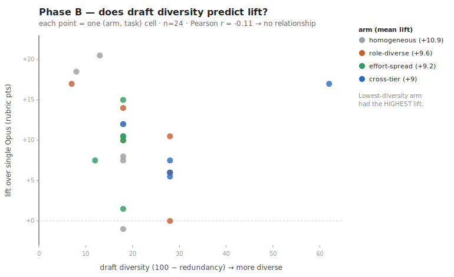

# Results — Phase B: is diversity the lever?

The natural assumption about an ensemble is that it works because the panel members *disagree* — diverse viewpoints the judge reconciles. This experiment tests that **directly**, because it decides something concrete: if diversity drives the lift, then adding genuinely different (e.g. non-Claude) models would be worth pursuing; if it doesn't, that's effort wasted.

**Design.** Baseline = single Opus. Four panel arms span low→high draft diversity, each synthesized by an Opus `xhigh` judge:

| Arm | Panel |
|---|---|
| **homogeneous** | 3× Sonnet, identical prompt (lowest diversity) |
| **role-diverse** | 3× Sonnet, distinct objectives (the kit default) |
| **effort-spread** | 3× Sonnet, roles at low/high/xhigh effort |
| **cross-tier** | latest Haiku + Sonnet + Opus (highest diversity) |

Per arm we measure draft **diversity** (= 100 − an LLM redundancy rating of the 3 drafts) and the **lift** over baseline. 6 harder/open tasks; blind 5-way scoring (baseline + 4 arms), two judges, strict calibration. **Crux:** pool all 24 (arm, task) cells and correlate diversity with lift. Harness: [`phaseB.js`](phaseB.js); raw: [`raw-phaseB.json`](raw-phaseB.json).

## Headline (measured — this set only)

| Arm | Diversity | Lift vs Opus | Score |
|---|--:|--:|--:|
| homogeneous (lowest diversity) | 15.5 | **+10.9** | 89.0 |
| role-diverse (default) | 21.2 | +9.6 | 87.7 |
| effort-spread | 17.0 | +9.2 | 87.3 |
| cross-tier (highest diversity) | 32.0 | **+9.0** | 87.1 |

Baseline (single Opus) mean: **78.1**. **Diversity↔lift correlation: r = −0.11 (n=24) — no relationship.**

## Findings

1. **Diversity does not predict lift.** Ordered by increasing diversity, the arms show flat-to-slightly-*declining* lift. The **lowest-diversity panel (homogeneous) had the highest lift**; the **highest-diversity panel (cross-tier) had the lowest**. The intuitive "diverse viewpoints win" story does not survive the direct test.
2. **The lift is large and roughly constant (~+9 to +11) regardless of panel composition.** *Any* 3-draft panel + an `xhigh` Opus judge beats single Opus by ~+10 on these hard tasks. The gain is the **panel→judge process itself**, not the diversity of the drafts.
3. **Consistent with the founding result.** Opus *self-fused* (a panel of identical Opus copies) scores +6.7 over solo Opus with zero diversity — the original hint that the judge/synthesis step, not breadth, is the engine. Phase B confirms it: a homogeneous panel captures the full lift.

## What this decides

- **The kit keeps the simple Sonnet panel as the default.** The lift doesn't come from panel *diversity* (draft *tier* is a separate axis — see the update in [results-v2.md](results-v2.md)). It comes from the judge process + the judge's effort (see [results-phaseA.md](results-phaseA.md)).
- **No cross-vendor "diversity" feature is planned — but note the scope of this null.** This result is **within-Claude only**: diversity here varied by role, effort, and model *tier*, never by *vendor*. It does **not** speak to cross-vendor error-decorrelation among comparably-strong models — a branch this subscription-only project doesn't test (it would need non-Claude API keys). A public data point on that branch (a 2026 cross-vendor inference-scaling benchmark — see [`REFERENCES.md`](../REFERENCES.md)) reports a small gain from adding a different-vendor model to a same-model panel (e.g. Opus+Opus → Opus+GPT) — consistent with *either* a stronger second model *or* genuine cross-vendor decorrelation, and the data can't separate the two. So cross-vendor is **untested, not rejected**; within Claude, diversity is not the lever (the judge process + effort is). Notably, that same source's *same-model* self-ensemble (Opus+Opus beating solo Opus, zero cross-model diversity) independently reproduces this file's core finding.

## Update — panel-size sweep + duplicate control

A later, more discriminating pass (blind **pairwise** scoring, which doesn't saturate the way an absolute rubric can, on verification-heavy tasks) swept the panel size *N* and added a duplicate-context control. Two clean results:

- **Breadth has diminishing returns and plateaus by ~N=5.** A 3-draft panel beats 1-draft-plus-judge by a wide margin; **5 beats 3 only modestly; 9 ≈ 5 (no further gain).** Each extra independent draft adds less than the last — the concave saturation a best-of-N *coverage* model predicts.
- **It's independent samples, not context.** Feeding the judge **one draft copied three times** gives **no lift** over a single draft, and loses decisively to a real 3-*independent*-draft panel. So the lever is genuinely *more independent attempts to synthesise from* — not just more text in the judge's context.

Together with the diversity result above, this pins the mechanism: the panel helps because **independent draws raise the chance the correct claim is present for the judge to verify and keep** (coverage), and that saturates fast. So the kit fixes a small **N=3** panel as the cost-optimal point on the curve.

## Caveats (read these)

- **The diversity proxy is coarse.** An LLM redundancy rating clusters tightly and barely separated the homogeneous panel from the role-diverse one (it did flag cross-tier as most diverse). So the conclusion leans on the **arm design** — where the deliberately most-diverse arm had the *lowest* lift — more than on the noisy per-cell number. A stronger proxy (embeddings) would firm it up.
- **Cross-tier confound.** The cross-tier arm injects a weaker Haiku draft, so its low lift could be Haiku-drag rather than diversity-hurts. But the equal-quality Sonnet-only arms also show no positive diversity→lift, so the conclusion holds either way.
- **n = 6 tasks; two Claude judges.** r = −0.11 means "no relationship," not "proven negative." An indication, not a benchmark. Reproduce/extend via [`phaseB.js`](phaseB.js).
