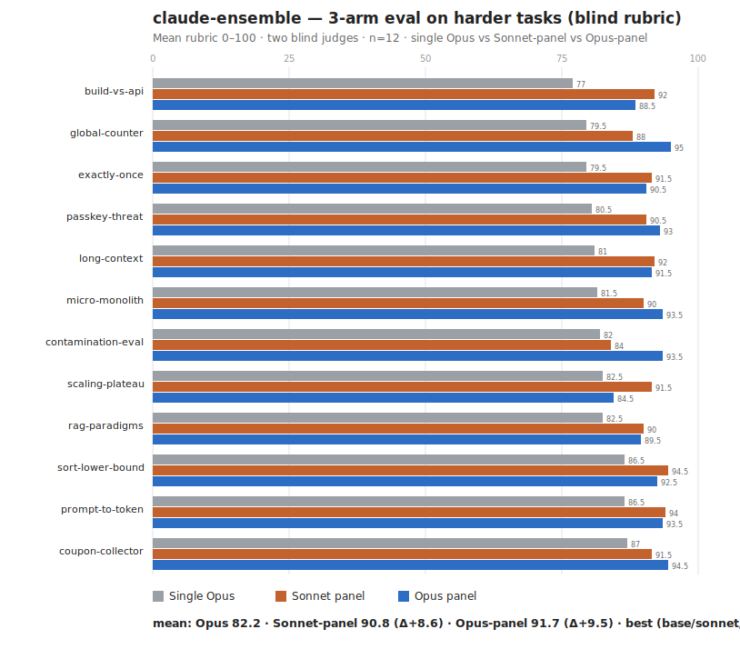

# Results — v2, 3-arm eval on harder tasks

> **Methodology trail — findings stand, but any "default/shipped" config named below is superseded.** The shipped kit now defaults to a best-of-N **Opus** panel → **max-effort Opus judge** → verify→revise loop. See the [eval index](README.md) and the [top-level README](../README.md).

A follow-up to [`results.md`](results.md). The v1 eval showed only a +4.2 ensemble edge — but its baseline already scored ~90/100, so the rubric had saturated. v2 uses **harder, higher-headroom tasks** and adds a third arm to test whether a **stronger (Opus) panel** closes the gap to the multi-model ensemble literature.

- **A — baseline:** one Opus pass (high effort).
- **B — Sonnet panel:** the then-default ensemble (3 Sonnet objective-diverse drafts → Opus judge).
- **C — Opus panel:** the "max" preset (3 Opus drafts → critique-first Opus judge, xhigh).

12 harder tasks (deep research, distributed-systems design, security threat-modeling, proofs, methodology). Each of the three answers blind-scored 0–100 by two judges (Opus + Sonnet) under a randomized X/Y/Z permutation, with a strict anti-saturation calibration. Method + caveats: [README](README.md). Raw: [raw-v2.json](raw-v2.json).

## Headline (measured — this set only)

| Arm | Mean rubric | Δ vs single Opus | Tasks won |
|---|--:|--:|--:|
| Single Opus | 82.2 | — | 0 / 12 |
| **Sonnet panel** (default) | **90.8** | **+8.6** | 7 / 12 |
| Opus panel ("max") | 91.7 | +9.5 | 5 / 12 |

## Two findings

**1. The ceiling hypothesis holds — the real lift is ~+9, not +4.2.** On harder tasks the single-Opus baseline fell to **82.2** (vs ~90 in v1), and the ensemble edge widened to **+8.6 / +9.5**. Single Opus won **0 of 12**. v1's small margin was a saturated-rubric artifact, not a weak system — the lift is in line with the multi-model ensemble literature once there is headroom to measure it.

**2. A pricier Opus panel barely helps — and is not the lever.** The Opus panel beat the Sonnet panel by only **+0.9** in aggregate and won **fewer** tasks (5 vs 7), at ~2× the usage. The most likely reason is the project's own thesis turned on itself: three Opus drafts correlate more with each other *and* with the Opus judge, so individual draft quality rises but **panel diversity falls**, and the two roughly cancel. The value of the ensemble is the **judge + objective-diversity**, not the panel's model tier. (Note `scaling-plateau`, where the Opus panel scored *worse*, 84.5 vs 91.5 — consistent with reduced diversity producing a narrower, weaker synthesis.)

The Opus panel does win the hardest **design / systems / methodology** tasks (`global-counter` +7, `contamination-eval` +9.5, `micro-monolith`, `passkey`, `coupon`) — so "max" is situational, not a general upgrade.

> **Update (2026-06-19) — finding #2 was partly reversed by a more rigorous pass.** The "+0.9, Opus panel barely helps" result above was measured with an `xhigh` judge under an **absolute** rubric that *saturates* on strong-vs-strong answers (it can't separate two already-excellent drafts). A later evaluation using **blind pairwise** scoring (no saturation), a **`max` *verifying* judge** (with tools, so it runs the checks), and an **independent non-Claude cross-grader (Gemini 3.5 Flash)** found the **Opus panel pulls clearly ahead** on verification-heavy technical tasks — ≈**73% (Claude) / 82% (Gemini)** pairwise win-rate over the Sonnet panel, ~9–10 of 11 tasks, consistent across both labs' graders and both answer orders. The reconciliation: the Opus panel's edge only surfaces with a *verifying* judge; at an `xhigh` paraphrasing judge it ≈ ties (hence +0.9 here). **Corrected product picture: Sonnet panel = cheap throughput default; Opus panel + `max` judge = the quality-max preset for hard, checkable work.** Note the "diversity isn't the lever" result is unchanged — draft **tier** (Opus vs Sonnet) is a different axis from draft **diversity**.

## Per task (sorted by baseline, most headroom first)

| Task | Domain | Single Opus | Sonnet panel | Opus panel | Best |
|---|---|--:|--:|--:|:--|
| build-vs-api | analysis | 77.0 | 92.0 | 88.5 | sonnet |
| global-counter | systems-design | 79.5 | 88.0 | 95.0 | opus |
| exactly-once | debugging | 79.5 | 91.5 | 90.5 | sonnet |
| passkey-threat | security | 80.5 | 90.5 | 93.0 | opus |
| long-context | deep-research | 81.0 | 92.0 | 91.5 | sonnet |
| micro-monolith | analysis | 81.5 | 90.0 | 93.5 | opus |
| contamination-eval | methodology | 82.0 | 84.0 | 93.5 | opus |
| scaling-plateau | deep-research | 82.5 | 91.5 | 84.5 | sonnet |
| rag-paradigms | deep-research | 82.5 | 90.0 | 89.5 | sonnet |
| prompt-to-token | conceptual | 86.5 | 94.0 | 93.5 | sonnet |
| sort-lower-bound | math | 86.5 | 94.5 | 92.5 | sonnet |
| coupon-collector | math | 87.0 | 91.5 | 94.5 | opus |

## What this means for the kit

*(Revised per the 2026-06-19 update above.)*
- **Sonnet panel = the cost-efficient option** (then the default). It captures much of the lift at a fraction of the Opus-panel cost and conserves Opus usage under rate limits — the kit now exposes it as the cheaper opt-in (`PANEL_MODEL='sonnet'`) and defaults to the Opus panel.
- **Opus panel + `max` judge = quality-max preset.** On verification-heavy / checkable work it pulls clearly ahead (73–82% pairwise, externally cross-graded) — reach for it when quality matters more than usage budget. It looked merely "situational (+0.9)" here only because this eval used an `xhigh` judge and a saturating absolute rubric.
- **The levers are panel *breadth* + a *verifying* (`max`) judge — not draft diversity.** Diversity still doesn't predict lift (r=−0.11); but more drafts and a higher-tier panel *do* help once the judge actually verifies. Cross-lab diversity remains untested (needs API keys).

## Caveats (unchanged)

n=12, this set only; Claude judges (same-family preference possible — note both judges still ranked single Opus last on every task, which is reassuring); directional, not a general benchmark. Reproduce/extend via [`run-v2.js`](run-v2.js).
