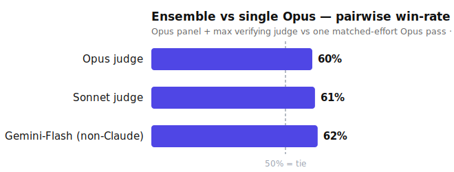

# v3 — Pairwise, three-grader (the honest current number)

The v1/v2 runs scored each answer on an absolute **0–100 rubric**. On strong answers that rubric **saturates** —
everything clusters near the ceiling, so the deltas (+4.2, +9) are small differences between large, noisy numbers, and
they **over-state** the real gap. v3 fixes the metric, and adds the check that matters most:

- **Blind pairwise.** The two answers are compared head-to-head and the judge picks a winner. Every pair is graded in
  **both answer-orders** to cancel position bias. **Win-rate**, not score delta, is the metric of record.
- **An independent non-Claude grader.** Every Claude judge shares a training lineage with the Claude panel, so it may
  prefer Claude-shaped writing. We added **Gemini-Flash** as a third, out-of-family grader — the real test for
  same-family self-preference.
- **Clean inputs.** Answers are stripped to the answer body (no process or verification narration), so no arm is
  de-blinded by *how* it was produced.

## Setup

- **Ensemble (quality-max):** three Opus drafts — each independently reasons from first principles and verifies its own
  key claims — synthesized by a **`max`-effort Opus judge that verifies** the drafts (running the checks where it can)
  and resolves conflicts into one answer.
- **Baseline:** a single Opus pass given the **same** verify-then-answer instruction — a **matched-effort** baseline, not
  a weak one.
- **n = 8** hard tasks (systems design, algorithmic assessment, ML-evaluation methodology, product strategy), three
  graders (Opus, Sonnet, Gemini-Flash), both answer-orders.

## Result — ensemble win-rate vs a single Opus pass

| Grader | Ensemble win-rate |
|---|--:|
| Opus | 56–63% |
| Sonnet | 56–67% |
| **Gemini-Flash (non-Claude)** | **62%** (no ties) |
| **Consensus** | **~60%** |

All three graders favor the ensemble — and the key result is that **the independent non-Claude grader confirms it.**

## What it means

1. **The ensemble's edge over a single model is real and cross-grader-confirmed — but modest: ~60% pairwise, not the
   "+9" the saturated rubric suggested.** This is the honest correction to v1/v2: the win is genuine and survives an
   out-of-family judge, but it is a moderate preference, not a landslide.
2. **It costs ~3.5× a single pass** (three Opus drafts + an Opus judge vs one Opus pass). So **a single high-effort Opus
   pass is the performance-per-cost frontier**; the panel buys the modest quality edge for cost-insensitive, quality-max
   work.
3. **The edge requires *guided* drafts.** A panel of *bare* drafts (no per-draft reasoning/verification) **tied** the
   single baseline to the neutral grader (~50%). Only when each draft independently reasons + verifies **and** the judge
   verifies does the panel pull ahead. The lever is **guided verification at both the draft and the synthesis step** —
   not the panel structure by itself.

## Caveats

- **n = 8, these tasks only.** Directional, not a benchmark.
- **Gemini-Flash is a lighter grader** than the Claude judges — but here it was decisive (zero ties) and agreed with
  them, which is exactly what makes it a useful out-of-family check.
- The clean run did **not** cleanly separate verifiable vs pure-judgment tasks (small per-stratum n); don't read the
  task-type split as signal.
- v1 / v2 / phaseA / phaseB / panel remain below as the methodology trail. **This page supersedes their headline
  magnitude;** their *mechanism* findings (the judge's effort is the main lever; draft diversity does not predict the
  lift) still stand.

## Reproduce

Same protocol as the rest of `eval/`, with two changes: score **pairwise** (winner per pair, both answer-orders) rather
than on the absolute rubric, and add a **non-Claude grader** alongside the Opus and Sonnet judges. Compare the
quality-max ensemble (Opus panel + `max` verifying judge) against a single Opus pass given the same verify-then-answer
instruction.
