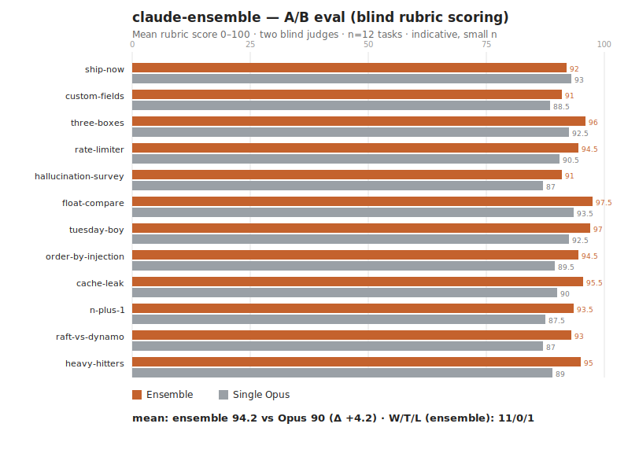

# Results — claude-ensemble A/B eval

12 tasks, single-Opus baseline vs the ensemble pipeline. Each answer blind-scored 0–100 against its rubric by two independent judges (Opus + Sonnet), with answers under randomized X/Y labels and provenance stripped. Method and caveats: [README](README.md). Raw data: [raw.json](raw.json).

## Headline (measured — this set only)

| Metric | Value |
|---|---|
| Tasks (n) | 12 |
| Ensemble mean rubric score | **94.2 / 100** |
| Single-Opus mean | **90.0 / 100** |
| Mean delta | **+4.2** |
| Win / tie / loss (ensemble) | **11 / 0 / 1** |

The ensemble scored higher on 11 of 12 tasks, and **both judges agreed on the winner on every task**. The one baseline win was `ship-now` (open-ended analysis), by a single point.

## Per task

| Task | Domain | Ensemble | Single Opus | Δ | Winner |
|---|---|--:|--:|--:|:--|
| n-plus-1 | coding | 93.5 | 87.5 | +6.0 | ensemble |
| raft-vs-dynamo | systems-design | 93.0 | 87.0 | +6.0 | ensemble |
| heavy-hitters | coding | 95.0 | 89.0 | +6.0 | ensemble |
| cache-leak | debugging | 95.5 | 90.0 | +5.5 | ensemble |
| order-by-injection | security | 94.5 | 89.5 | +5.0 | ensemble |
| tuesday-boy | math | 97.0 | 92.5 | +4.5 | ensemble |
| rate-limiter | systems-design | 94.5 | 90.5 | +4.0 | ensemble |
| hallucination-survey | deep-research | 91.0 | 87.0 | +4.0 | ensemble |
| float-compare | conceptual | 97.5 | 93.5 | +4.0 | ensemble |
| three-boxes | reasoning | 96.0 | 92.5 | +3.5 | ensemble |
| custom-fields | data-modeling | 91.0 | 88.5 | +2.5 | ensemble |
| ship-now | analysis | 92.0 | 93.0 | −1.0 | baseline |

## How to read this (honestly)

- **A modest, consistent edge — not a blowout.** ~+4 points on a 0–100 rubric, repeated across nearly every task. That matches the design thesis: the judge/synthesis step buys a real but *bounded* lift on hard tasks. It is not evidence of a dramatic capability jump.
- **Cost is the trade.** That edge costs roughly **3–5× the usage** of a single Opus call (1 Haiku gate + 3 Sonnet drafts + 1 Opus judge). Worth it when correctness outweighs usage; wasteful on routine work — which is why the gatekeeper exists.
- **Same-family judging caveat.** Both judges are Claude models, and the ensemble's own synthesizer is Opus, so some self-preference may inflate the delta. The cross-tier Sonnet judge agreed with Opus on all 12 — reassuring, not dispositive. Treat +4.2 as directional.
- **n = 12, this set only.** An indication, not a benchmark. The hardest, most open-ended task (`ship-now`) is also the one the ensemble lost — a useful reminder that synthesis helps least where there is no single correct answer to converge on.

## Reproduce / extend

Edit or add tasks in [`run.js`](run.js), run the workflow, save the returned JSON to `raw.json`, then `python3 eval/chart.py`.
